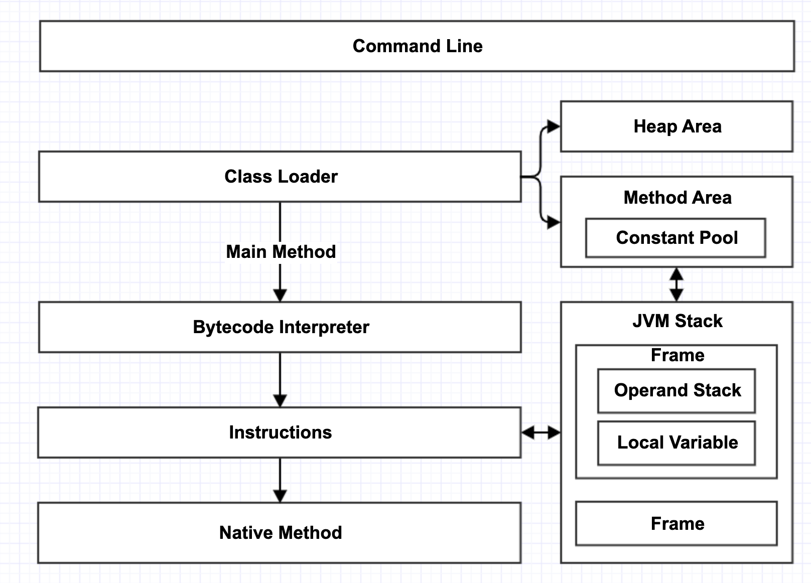

# jean
基于Golang的Java Virtual Machine。



## 使用

```
jean [-options] class [args...]
```

选项：

- `-help/?`：打印帮助信息
- `-version`：查看版本
- `-verbose:class`：允许打印类加载信息
- `-verbose:inst`：允许打印字节码指令信息
- `-classpath/cp`：指定要加载的类路径
  - 不指定时按如下方式确定：CLASSPATH环境变量->当前目录
- `-Xjre`：指定jre目录
  - 不指定时按如下方式确定：当前目录->JAVA_HOME环境变量

## 项目名称由来


