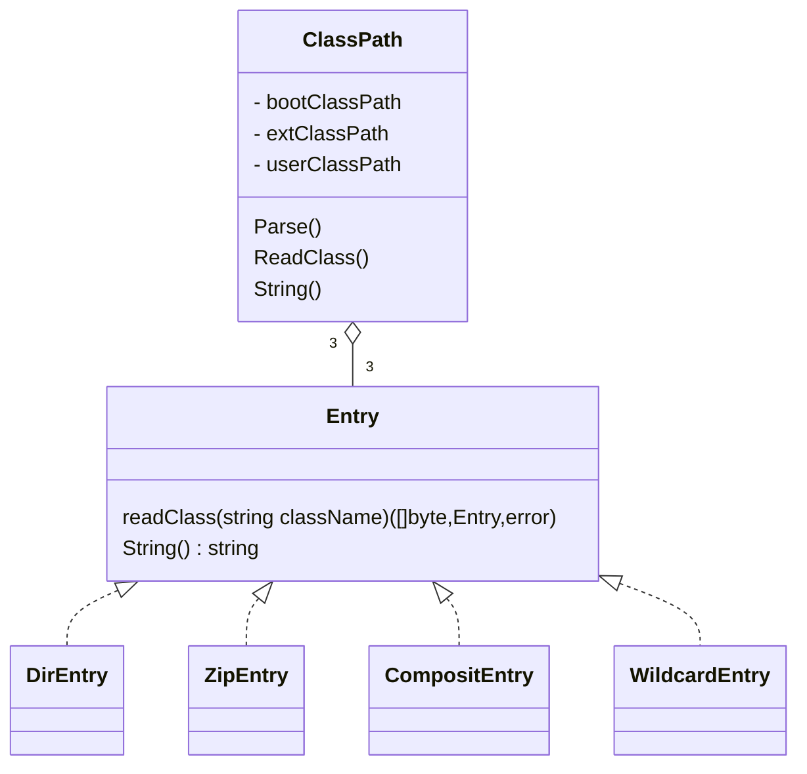

# 第2章 搜索class文件

## 类路径

按照搜索的先后顺序，类路径可分为以下3部分：

* 启动类路径(bootstrap classpath)
  * 默认为`jre\lib`
  * 可通过`-Xbootclasspath`选项修改启动类路径，此项优先级最高
  * 可从环境变量`JAVA_HOME`中寻找
* 扩展类路径(extension classpath)
  * `jre\lib\ext`
* 用户类路径(user classpath)
  * 用户类路径默认值为当前目录
  * 可设置`CLASSPATH`环境变量修改类路径
  * 更好的方法是传递`-classpath/-cp`选项，此选项优先级更高

`-classpath/-cp`选项：

* 既可以指定目录，也可以指定JAR文件或ZIP文件
* 还可同时指定多个目录或文件，用分隔符分开

### 设计

Entry接口提供两个方法：

* `readClass`: 根据给定类，寻找和加载类文件
* `String()`：返回类路径

四个实现：

* DirEntry：指定class文件路径时对应的实体
* ZipEntry：指定jar包或zip文件时对应的实体
* CompositEntry：指定多个class文件路径时对应的实体
* WildcardEntry：采用通配符指定多个jar包时对应的实体

搜索类文件时调用`ClassPath`的`Parse()`方法：

* 搜索并加载启动类路径
* 搜索并加载用户类路径

读取类时：

* 先读取用户类路径和扩展类路径下的类
* 再读取用户类路径下的类