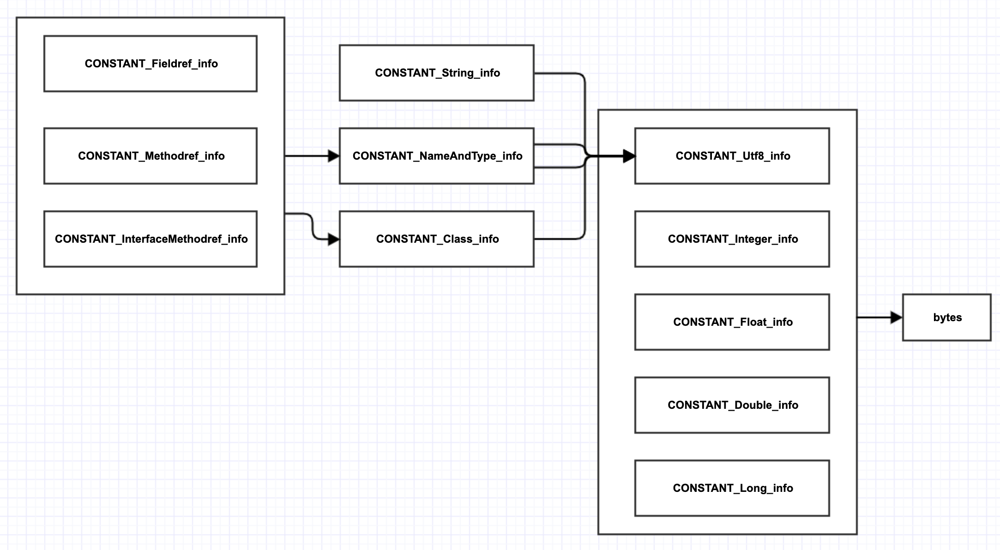

# 第3章 解析class文件

Java虚拟机规范对class文件格式进行了严格的规定，但对从何处加载class文件，给了足够的自由。

Class文件是以一组8个字节为基础单位的二进制流，各个数据项目严格按照顺序紧凑排列，中间无任何分隔符。

当遇到需要占用8个字节以上的空间的数据项时，以高位在前的方式分隔成若干8个字节进行存储。

Java虚拟机规范使用一种类似C语言的结构体语法来描述class文件格式。class文件被描述为一个ClassFile结构：

```c
ClassFile{
  u4 magic;
  u2 minor_version;
  u2 major_version;
  u2 constant_pool_count;
  cp_info constant_pool[constant_pool_count-1];
  u2 access_flags;
  u2 this_class;
  u2 super_class;
  u2 interfaces_count;
  u2 interfaces[interfaces_count];
  u2 fileds_count;
  field_info fields[fields_count];
  u2 methods_count;
  method_info methods[methods_count];
  u2 attributes_count;
  attribute_info attributes[attributes_count];
}
```

只有两种数据类型：

* 无符号数：描述数字、索引引用、数量值、UTF-8编码的字符串值
* 表：由多个无符号数或者其他表作为数据项构成的复合数据类型
  * 所有的表命名以`_info`结尾
  * 表用于描述有层次关系的复合结构的数据

## 解析class文件

### 1.魔数

每个class文件的头4个字节被称为魔数，用于确定此文件是否为一个虚拟机所能接受的Class文件。

Class文件的魔数为`0xCAFEBABE`

Java虚拟机规范规定，如果加载的class文件不符合要求的格式，Java虚拟机实现就抛出`java.lang.ClassFormatError`异常

### 2.版本号

* 第5和6字节是次版本号
  * 只在J2SE 1.2之前用过，从1.2开始基本上就没什么用了（都是0）
* 第7和第8字节是主版本号
  * 主版本号在J2SE 1.2之前是45，从1.2开始，每次有大的Java版本发布，都会加1

假设某class文件的主版本号是M，次版本号是m，那么完整的版本号可以表示成“M.m”的形式。

特定的Java虚拟机实现只能支持版本号在某个范围内的class文件，如果版本号不在支持的范围内，Java虚拟机实现就抛出`java.lang.UnsupportedClassVersionError`异常

### 3.常量池

常量池占据了class文件很大一部分数据。由于常量池中常量的数量不固定，常量池的入口前放置一项u2类型数据`constant_pool_count`

有3点需要特别注意：

1. `constant_pool_count`给出的常量池大小比实际大1。假设给出的值是n，那么常量池的实际大小是n-1
2. 有效的常量池索引是1～n-1。0是无效索引，表示不指向任何常量
3. `CONSTANT_Long_info``和CONSTANT_Double_info`各占两个位置
   1. 也就是说，如果常量池中存在这两种常量，实际的常量数量比n-1还要少，而且1～n-1的某些数也会变成无效索引

常量池中主要存放两大类常量：

* 字面量(Literal)
  * 文本字符串、被声明为`final`的常量值等
* 符号引用(Symbolic References)
  * 被模块导出或者开放的包(Package)
  * 类和接口的全限定名(Fully Qualified Name)
  * 字段的名称和描述符(Descriptor)
  * 方法的名称和描述符
  * 方法句柄和方法类型(Method Handle、Method Type、Invoke Dynamic)
  * 动态调用点和动态常量(Dynamically-Computed Call Site、Dynamically-Computed Constant)

当虚拟机做类加载时，将会从常量池获得对应的符号引用，再在类创建时或运行时解析、翻译到具体的内存地址之中。

#### 常量结构

常量池中每一项常量都是一个表，截止到JDK13，共有17种不同类型的常量。17类表结构起始的第一位都是一个u1类型的标志位tag，代表着当前常量属于哪种类型。

```go
const (
	CONSTANT_Utf8               = 1
	CONSTANT_Integer            = 3
	CONSTANT_Float              = 4
	CONSTANT_Long               = 5
	CONSTANT_Double             = 6
	CONSTANT_Class              = 7
	CONSTANT_String             = 8
	CONSTANT_FieldRef           = 9
	CONSTANT_MethodRef          = 10
	CONSTANT_InterfaceMethodRef = 11
	CONSTANT_NameAndType        = 12
	CONSTANT_MethodHandle       = 15
	CONSTANT_MethodType         = 16
	CONSTANT_Dynamic            = 17
	CONSTANT_InvokeDynamic      = 18
	CONSTANT_Moudule            = 19
	CONSTANT_Package            = 20
)
```

java虚拟机规范给出的常量结构：

```c
cp_info{
  u1 tag;
  u1 info[];
}
```

##### CONSTANT_Utf8_info

常量结构如下：

```c
CONSTANT_Utf8_info{
  u1 tag;
  u1 length;
  u1 bytes[length];
}
```

`length`值说明这个UTF-8编码的字符串长度是多少字节。

后面紧跟着长度为`length`字节的连续数据，是一个使用UTF-8缩略编码表示的字符串。

Class文件中，方法、字段等都需要引用`CONSTANT_Utf8_info`常量来描述名称，所以`CONSTANT_Utf8_info`常量的最大长度即为Java中方法、字段名的最大长度。而这个最大长度即为`length`的最大长度，即u2类型能表达的最大值`65535`，即64K。

注意：字符串在class文件中是以MUTF-8（Modified UTF-8）方式编码的

##### CONSTANT_Integer_info

使用4字节存储整数常量，结构如下：

```c
CONSTANT_Integer_info{
  u1 tag;
  u4 bytes;
}
```

`CONSTANT_Integer_info`正好可以容纳一个Java的`int`型常量，但实际上比`int`更小的`boolean、byte、short`和`char`类型的常量也放在`CONSTANT_Integer_info`中

##### CONSTANT_Float_info

使用4字节存储IEEE754单精度浮点数常量，结构如下：

```c
CONSTANT_Integer_info{
  u1 tag;
  u4 bytes;
}
```

##### CONSTANT_Long_info

使用8字节存储整数常量，结构如下：

```c
CONSTANT_Integer_info{
  u1 tag;
  u4 high_bytes;
  u4 low_bytes;
}
```

##### CONSTANT_Double_info

使用8字节存储IEEE754双精度浮点数，结构如下：

```c
CONSTANT_Double_info{
  u1 tag;
  u4 high_bytes;
  u4 low_bytes;
}
```

##### CONSTANT_String_info

表示`java.lang.String`字面量，结构如下：

```c
CONSTANT_String_info{
  u1 tag;
  u2 string_index;
}
```

`CONSTANT_String_info`本身并不存放字符串数据，只存了常量池索引，这个索引指向一个`CONSTANT_Utf8_info`常量

##### CONSTANT_Class_info

表示类或者接口的符号引用，结构如下：

```c
CONSTANT_Class_info{
  u1 tag;
  u2 name_index;
}
```

和`CONSTANT_String_info`类似，`name_index`是常量池索引，指向`CONSTANT_Utf8_info`常量，常量代表累或接口的全限定名。

##### CONSTANT_NameAndType_info

给出字段或方法的名称和描述符。`CONSTANT_Class_info`和`CONSTANT_NameAndType_info`加在一起可唯一确定一个字段或者方法，结构如下：

```c
CONSTANT_NameAndType_info{
  u1 tag;
  u2 name_index;
  u2 descriptor_index;
}
```

字段或方法名由`name_index`给出，字段或方法的描述符由`descriptor_index`给出。

`name_index`和`descriptor_index`都是常量池索引，指向`CONSTANT_Utf8_info`常量。

字段和方法名就是代码中出现的（或者编译器生成的）字段或方法的名字。Java虚拟机规范定义了一种简单的语法来描述字段和方法，可以根据下面的规则生成描述符：

1. 类型描述符
   1. 基本类型`boolean、byte、short、char、int、long、float`和`double`的描述符是单个字母，分别对应`Z、B、S、C、I、J、F`和`D`
      1. 注意，`long`的描述符是`J`而不是`L`
   2. 引用类型的描述符是`L+类的完全限定名+分号`
   3. 数组类型的描述符是`[+数组元素类型描述符`
2. 字段描述符就是字段类型的描述符
3. 方法描述符是`(分号分隔的参数类型描述符)+返回值类型描述符`，其中`void`返回值由单个字母`V`表示。

示例

| 字段描述符           | 字段类型           | 方法描述符               | 方法                                   |
| -------------------- | ------------------ | ------------------------ | -------------------------------------- |
| `S`                  | `short`            | `()V`                    | `void run()`                           |
| `Ljava.lang.Object`  | `java.lang.Object` | `()Ljava.lang.String;`   | `String toString()`                    |
| `[I`                 | `int[]`            | `([Ljava.lang.String;)V` | `void main(String[] args)`             |
| `[[D`                | `double[][]`       | `(FF)F`                  | `float max(float x,float y)`           |
| `[Ljava.lang.String` | `String[]`         | `([JJ)I`                 | `long binarySearch(long[] a,long key)` |

Java语言支持方法重载，不同的方法可以有相同的名字，只要参数列表不同即可。这就是为什么`CONSTANT_NameAndType_info`结构要同时包含名称和描述符的原因。

从class文件层面上讲，只要两个字段的字段描述符不同，字段名可以相同，但Java语言禁止出现名称相同的字段。

##### CONSTANT_Fieldref_info、CONSTANT_Methodref_info、CONSTANT_InterfaceMethodref_info

分别表示字段符号引用、普通（非接口）方法符号引用、接口方法符号引用，它们结构相同：

```c
CONSTANT_Fieldref_info{
  u1 tag;
  u2 class_index;
  u2 name_and_type_index;
}
```

`class_index`和`name_and_type_index`都是常量池索引，分别指向`CONSTANT_Class_info`和`CONSTANT_NameAndType_info`常量。

#### 常量间关系图



### 4.类访问标志

一个16位的“bitmask”，指出class文件定义的是类还是接口，访问级别是public还是private，等等。

### 5.类和超类索引

 class文件存储的类名类似完全限定名，但是把点换成了斜线，Java语言规范把这种名字叫作二进制名（binary names）。

因为每个类都有名字，所以`thisClass`必须是有效的常量池索引。除`java.lang.Object`之外，其他类都有超类，所以`superClass`只在`Object.class`中是0，在其他class文件中必须是有效的常量池索引。

### 6.接口索引表

类和超类索引后面是接口索引表，表中存放的也是常量池索引，给出该类实现的所有接口的名字。

### 7.字段和方法表

分别存储字段和方法信息。字段和方法的基本结构大致相同，差别仅在于属性表。

结构

```c
field_info{
  u2 access_flags;
  u2 name_index;
  u2 descriptor_index;
  u2 attributes_count;
  attribute_info attributes[attributes_count];
}
```

和类一样，字段和方法也有自己的访问标志。访问标志之后是一个常量池索引，给出字段名或方法名，然后又是一个常量池索引，给出字段或方法的描述符，最后是属性表。

#### 属性表

常量是由Java虚拟机规范严格定义的，但属性是可以扩展的，不同的虚拟机实现可以定义自己的属性类型。

由于这个原因，Java虚拟机规范没有使用tag，而是使用属性名来区别不同的属性。

属性数据放在属性名之后的u1表中，这样Java虚拟机实现就可以跳过自己无法识别的属性。

属性结构定义：

```c
attribute_info{
  u2 attribute_name_index;
  u4 attribute_length;
  u1 info[attribute_length];
}
```

属性名实际上是常量池索引，指向常量池中的`CONSTANT_Utf8_info`

按照用途，23种预定义属性可以分为三组：

1. 实现Java虚拟机所必需的，共有5种
2. Java类库所必需的，共有12种
3. 主要提供给工具使用，共有6种
   1. 第三组属性是可选的，可以不出现在class文件中。如果class文件中存在第三组属性，Java虚拟机实现或者Java类库也是可以利用它们

##### Deprecated和Synthetic

| 属性名称   | 使用位置           | 含义                             |
| ---------- | ------------------ | -------------------------------- |
| Deprecated | 类、方法表、字段表 | 被声明为Deprecated的方法和字段   |
| Synthetic  | 类、方法表、字段表 | 标识方法或字段为编译器自动生成的 |

二者都属于标志类型的布尔属性，只存在有和没有的区别，没有属性值。

`Deprecated`属性可通过`@Deprecated`注解设置。

`Synthetic`属性主要为了支持嵌套类和嵌套接口。

结构定义如下：

```c
Deprecated_attribute{
  u2 attribute_name_index;
  u4 attribute_length;
}
```

```c
Synthetic_attribute{
  u2 attribute_name_index;
  u4 attribute_length;
}
```

##### SourceFile

| 属性名称   | 使用位置 | 含义           |
| ---------- | -------- | -------------- |
| SourceFile | 类文件   | 记录源文件名称 |

记录生成这个Class文件的源码文件名称。

**可选定长属性**，可通过`Javac -g:none/-g:source`选项来关闭或要求生成这项信息。

在Java中，对于大多数类，类名和文件名一致，但特殊情况，如内部类除外。

如果不生成这项属性，抛出异常时，堆栈中不会显示错误代码所属的文件名。

结构：

```c
SourceFile_attribute{
  u2 attribute_name;
  u4 attribute_length;
  u2 sourcefile_index;
}
```

其中，`attribute_length`必须是`2`，`sourcefile_index`是常量池索引，指向`CONSTANT_Utf8_info`常量。

##### ConstantValue

| 属性名称      | 使用位置 | 含义                               |
| ------------- | -------- | ---------------------------------- |
| ConstantValue | 字段表   | 由`static final`关键字定义的常量值 |

作用是，通知虚拟机自动为静态变量赋值，只有被static关键字修饰的类变量才可以使用这项属性。

* 对非`static`类型的变量，即实例变量的赋值是在实例构造器`<init>()`方法中进行的
* 对于类变量，有两种方式可以选择：
  * 在类构造器`<cinit>()`方法中进行
  * 使用`ConstantValue`属性

目前Oracle公司的Javac编译器的实现是：

* 如果使用`static final`修饰变量，且此变量的数据类型是基本类型或`java.lang.String`，则生成`ConstantValue`属性进行初始化
* 如果没有被`final`修饰，或者`static final`修饰的并非基本类型及字符串，则将会选择在`<cinit>()`方法中进行初始化

结构如下：

```c
ConstantValue_attribute{
  u2 attribute_name_index;
  u4 attribute_length;
  u2 constantValue_index;
}
```

* `attribute_length`固定为2
* `constantValue_index`代表常量池中一个字面量常量，根据字段类型不同而不同

| 字段类型                      | 常量类型                |
| ----------------------------- | ----------------------- |
| `long`                        | `CONSTANT_Long_info`    |
| `float`                       | `CONSTANT_Float_info`   |
| `double`                      | `CONSTANT_Double_info`  |
| `int short char byte boolean` | `CONSTANT_Integer_info` |
| `String`                      | `CONSTANT_String_info`  |

##### Code

| 属性名称 | 使用位置 | 含义                       |
| -------- | -------- | -------------------------- |
| Code     | 方法表   | Java代码编译成的字节码指令 |

Java程序方法体中的代码经Javac编译后，最终变为字节码指令存储在`Code`属性内。

并非所有的方法表都必须存在`Code`属性，譬如接口或者抽象类中的方法就不存在`Code`属性。

Code属性是变长属性，结构定义如下：

```c
Code_attribute{
  u2 attribute_name_index;
  u4 attribute_length;
  u2 max_stack;
  u2 max_locals;
  u4 code_length;
  u1 code[code_length];
  u2 exception_table_length;
  exception_info exception_table[exception_table_length];
  u2 attribute_count;
  attribute_info attributes[attributes_count];
}
```

* `max_stack`表示操作数栈（Operand Stack）深度的最大值。方法执行的任意时刻，操作数栈都不会超过这个深度，虚拟机运行时需要据此分配栈桢中的操作栈深度。
* `max_locals`代表了局部变量表所需的存储空间，单位是变量槽(slot)
  * 变量槽是虚拟机为局部变量分配内存所使用的最小单位
* `code_length`和`code`用于存储Java源程序编译后生成的字节码指令
  * 每个指令长度为1个字节
  * 1个字节一共可以表示256条指令
  * 《Java虚拟机规范》中限制一个方法不允许超过65535条字节码指令，如果超过此长度，Javac编译器会拒绝编译

###### exception_info

方法的显式异常处理表集合，对于Code来说并不是必须存在的。

字段含义：

如果当字节码从第`start_pc`行到第`end_pc`行（不包含）出现了类型为`catch_type`或者其子类的异常(`catch_type`为指向一个`CONSTANT_Class_info`型常量的索引)，则转到第`handler_pc`行进行处理。当`catch_type`的值为0时，代表任意异常都需要转到`handler_pc`处进行处理。

##### Exceptions

| 属性名称   | 使用位置 | 含义               |
| ---------- | -------- | ------------------ |
| Exceptions | 方法表   | 方法抛出的异常列表 |

列举方法中可能抛出的受检异常，结构如下：

```c
Exceptions_attribute{
  u2 attribute_name_index;
  u4 attribute_length;
  u2 number_of_exceptions;
  u2 exception_index_table[number_of_exceptions]
}
```

* `number_of_exceptions`表示方法可能抛出`number_of_exceptions`种受检异常，每种受检异常使用一个`exception_index_table`项表示，`exception_index_table`是一个指向常量池中`CONSTANT_Class_info`型常量的索引，代表该受检异常的类型。

##### LineNumberTable和LocalVariableTable

| 属性名称           | 使用位置 | 含义                                 |
| ------------------ | -------- | ------------------------------------ |
| LineNumberTable    | Code属性 | Java源码的行号与字节码指令的对应关系 |
| LocalVariableTable | Code属性 | 方法的局部变量描述                   |

`LineNumberTable`用于描述Java源码行号与字节码行号之间的对应关系，并不是运行时必须属性，默认会生成到Class文件中，可以在Javac中使用`-g: none`或`-g: lines`选项来取消或要求生成信息。

`LocalVariableTable`用于描述栈桢中局部变量表的变量与Java源码中定义的变量之间的关系，并不是运行时必须属性，默认会生成到Class文件中，可以在Javac中使用`-g: none`或`-g: vars`选项来取消或要求生成信息。`

`LineNumberTable`的结构如下：

```c
LineNumberTable_attribute{
  u2 attribute_name_index;
  u4 attribute_length;
  u2 line_number_table_length;
  {
    u2 start_pc;  //字节码行号
    u2 line_number; //java源码行号
  } line_number_table[line_number_table_length];
}
```

