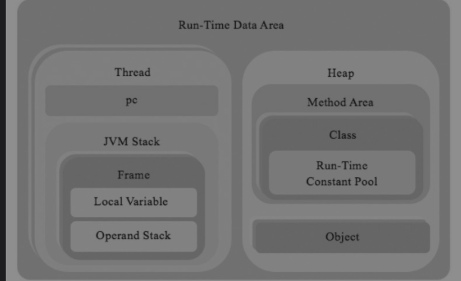
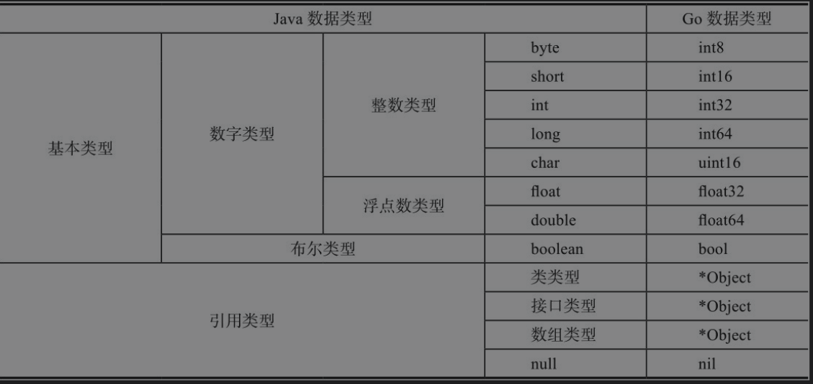

# 第4章 运行时数据区

## 4.1 运行时数据区概述

Java虚拟机会在执行Java程序的过程中，将其所管理的内存划分为若干个不同的数据区域，称这些内存区域为运行时数据区。

运行时数据区可以分为两类：

1. 多线程共享区域，需要在Java虚拟机启动时创建好，在Java虚拟机退出时销毁
   1. 主要存放类数据和类实例
      1. 类实例数据存放在堆中，由垃圾收集器定期清理
      2. 类数据包括字段和方法信息，方法字节码，运行时常量池，存放于方法区
2. 线程私有区域，在创建线程时才创建，线程退出时销毁
   1. 每个线程都有自己的程序计数器PC和Java虚拟机栈
   2. Java虚拟机栈由栈桢构成，保存方法执行的状态
      1. 包括局部变量表和操作数栈

定义：

* 当前方法：某一线程当前正在执行的方法
* 当前帧：执行当前方法的栈桢
* 当前类：声明当前方法的类

#### 程序计数器(Program Counter Register)

如果当前方法是Java方法，pc寄存器中存放当前正在执行的Java虚拟机指令的地址，若当前方法是本地方法，pc寄存器中的值没有确定意义。

字节码解释器工作时通过改变计数器的值选取下一条需要执行的字节码指令。

#### Java虚拟机栈(JVM Stack)

每个方法被执行时，Java虚拟机都会同步创建一个栈桢用于存储**局部变量表、操作数栈、动态链接、方法出口**等信息。

每个方法被调用直至执行完毕的过程，就对应着一个栈桢在虚拟机栈中从入栈到出栈的过程。

* 局部变量表：存放**编译期可知**的各种Java虚拟机基本数据类型、对象引用和returnAddress类型。
  * 数据类型在局部变量表中的存储空间以局部变量槽(Slot)表示
  * 每个slot至少可以容纳一个int或引用值，两个连续的slot可以容纳一个long或double值。

执行方法所需的局部变量表大小和操作数栈深度是由编译器预先计算好的，**存储在class文件method_info结构的Code属性中**

异常：

* `StackOverFlowError`：线程请求的栈深度大于虚拟机允许的深度
* `OutOfMemoryError`：如果Java虚拟机栈容量可动态扩展，栈扩展时无法申请到足够内存

## 4.2 数据类型

* 基本类型：存放数据本身
  * 布尔类型
  * 数字类型
    * 整数类型
    * 浮点数类型
* 引用类型：存放对象引用，真正的对象数据在堆中分配
  * 类类型：指向类实例
  * 接口类型：指向实现该接口的类或数组实例
  * 数组类型：指向数组实例
  * null：不指向任何对象

此处提到的变量包括：类变量(`static`非`static final`)、实例变量、数组元素、方法的参数和局部变量

