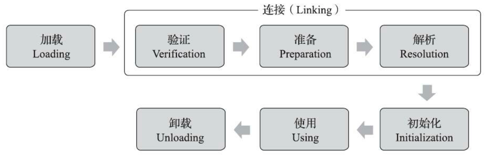

# 第6章 类和对象

## 6.1 方法区

存储已经被虚拟机加载的类型信息、常量、静态变量、即时编译器编译后的代码缓存等数据。

当Java虚拟机第一次使用某个类时，它会搜索类路径，找到相应的class文件，然后读取并解析class文件，把相关信息放进方法区。

### 6.1.1 类信息

#### 字段访问标志

```go
const (
	ACC_PUBLIC       = 0x0001  //class field method
	ACC_PRIVATE      = 0x0002  //      field method
	ACC_PROTECTED    = 0x0004  //      field method
	ACC_STATIC       = 0x0008  //      field method
	ACC_FINAL        = 0x0010  //class field method
	ACC_SUPER        = 0x0020  //class
	ACC_SYNCHRONIZED = 0x0020  //            method
	ACC_VOLATILE     = 0x0040  //      field
	ACC_BRIDGE       = 0x0040  //            method
	ACC_TRANSIENT    = 0x0080  //      field
	ACC_VARARGS      = 0x0080  //            method
	ACC_NATIVE       = 0x0100  //            method
	ACC_INTERFACE    = 0x0200  //class
	ACC_ABSTRACT     = 0x0400  //class       method
	ACC_STRICT       = 0x0800  //            method
	ACC_SYNTHETIC    = 0x1000  //class field method
	ACC_ANNOTATION   = 0x2000  //class
	ACC_ENUM         = 0x4000  //class field
)
```

#### 类名、父类名、接口名

存放对应名称的完全限定名。

#### 运行时常量池

#### 字段表

#### 方法表

## 6.3 类加载

虚拟机的类加载机制：Java虚拟机把描述类的数据从Class文件加载到内存，并对数据进行校验、转换解析和初始化，最终形成可以被虚拟机直接使用的Java类型。

Java语言中，类的加载、连接和初始化过程都是在程序运行期间完成的。

### 类加载的时机

类的生命周期：



类的加载过程必须按照上述顺序进行。

《Java虚拟机规范》中并没有对何时开始“加载”阶段进行强制约束，但对于初始化阶段，《Java虚拟机规范》严格规定了有且只有六种情况必须对类进行“初始化”，而初始化之前的阶段需要提前完成：

1. `new、getstatic、putstatic、invokestatic`指令时，如果类型没有进行过初始化，则需要先触发其初始化阶段。能够生成这4条指令的典型Java代码场景有：
   1. 使用new关键字实例化对象
   2. 读取或设置一个类型的静态字段(`public/protected/private static`，被final修饰、已在编译期把结果放入常量池的静态字段除外)
   3. 调用一个类型的静态方法
2. 使用`java.lang.reflect`包的方法对类型进行反射调用时，如果类型没有初始化，则需要先触发其初始化
3. 初始化类时，如果发现其父类没有初始化，则需要先触发其父类初始化
4. 虚拟机启动时，用户需要指定一个要执行的主类(包含main()方法的类)，虚拟机会先初始化这个主类
5. 当使用JDK7新加入的动态语言支持时，如果一个`java.lang.invoke.MehtodHandle`实例最后的解析结果为以下4中类型的方法句柄，并且这个方法句柄对应的类没有进行过初始化，则需要先触发其初始化
   1. `REF_getStatic`
   2. `REF_putStatic`
   3. `REF_invokeStatic`
   4. `REF_newInvokeSpecial`
6. 当一个接口中定义了JDK8新加入的默认方法(`default`)时，如果有这个接口的实现类发生了初始化，则该接口要在其之前被初始化

### 1.加载

加载阶段，Java虚拟机需要完成如下三件事：

1. 通过一个类的**全限定名**获取此类的二进制字节流
2. 将这个字节流所代表的静态存储结构转化为方法去的运行时数据结构
3. 在内存中生成一个代表这个类的`java.lang.Class`对象，作为方法区这个类的各种数据的访问入口

加载阶段结束后，Java虚拟机外部的二进制字节流就按照虚拟机所设定的格式存储在方法区之中。类型数据妥善安置在方法区之后，会在Java堆内存中实例化一个`java.lang.Class`类的对象，这个对象将作为程序访问方法区中的类型数据的对外接口。

### 2.验证

验证是连接阶段的第一步，目的是确保class文件的字节流中包含的信息符合《Java虚拟机规范》的全部约束要求。

验证阶段大致上会完成下面四个阶段的检验动作

#### （1）文件格式验证

#### （2）元数据验证

#### （3）字节码验证

#### （4） 符号引用验证

### 3.准备

准备阶段是正式为类中定义的变量（`static`变量）分配内存并设置类变量初始值（零值）的阶段

*实例变量将会在对象实例化时随着对象一起分配在Java堆中*

如果静态变量属于基本类型或`String`类型，有`final`修饰符，且它的值在编译期已知，则该值存储在class文件常量池中。在此阶段Java虚拟机就会设置对应的值，而不是零值。

### 4.解析

Java虚拟机将常量池内的符号引用替换为直接引用的过程。

符号引用：

* `CONSTANT_Class_info`
* `CONSTANT_Fieldref_info`
* `CONSTANT_Methodref_info`

#### （1）类或接口解析

假设当前代码所处的类为D，如果要把一个从未解析过的符号引用N解析为一个类或接口C的直接引用，则完整的解析过程包括以下三个步骤：

1. 如果C不是一个数组类型，虚拟机将把代表N的全限定名传递给D的类加载器去加载这个类C。在加载过程中，由于元数据验证、字节码验证的需要，又可能触发其他相关类的加载动作。一旦加载过程出现异常，解析过程宣告失败
2. 如果C是一个数组类型，且数组的元素类型为对象，即N的描述符类似`[Ljava/lang/Integer`的形式，将会按照第1点规则加载数组元素类型，接着由虚拟机生成一个代表该数组维度和元素的数组对象
3. 如果上面两步没有任何异常，则C在虚拟机中实际上已经成为一个有效的类或接口，但在解析完成前还要进行符号引用验证，确认D是否具备对C的访问权限。如果发现不具备访问权限，将抛出`java.lang.IllegalAccessError`

D拥有对C的访问权限，意味着以下3条规则中至少有一个成立：

* 被访问类C是`public`的，并且与访问类D处于同一模块中
* 被访问类C是`public`·的，不与访问类D处于同一模块中，但是被访问类C的模块允许被访问类D的模块进行访问
* 被访问类C不是`public`的，但是它与访问类D处于同一个包中

#### （2）字段解析

要解析一个未被解析过的字段符号引用，首先要对这个字段所属的类或接口的符号引用进行解析。如果解析成功完成，把这个字段所属的类或接口用C表示，《Java虚拟机规范》要求按照如下步骤对C进行后续字段的搜索：

1. 如果C本身包含了简单名称和字段描述符都与目标相匹配的字段，则返回这个字段的直接引用，查找结束
2. 否则，如果在C中实现了接口，将会按照继承关系从下至上递归搜索各个接口和它们的父接口，如果接口中包含了简单名称和字段描述符都与目标相匹配的字段，则返回这个字段的直接引用，查找结束
3. 否则，如果C不是`java.lang.Object`，将会按照继承关系从下至上递归搜索其父类，如果在父类中博阿憨了简单名称和字段描述符都与目标相匹配的字段，则返回这个字段的直接引用，查找结束
4. 、否则，查找失败，抛出`java.lang.NoSuchFieldError`

以上解析规则保证Java虚拟机获得字段唯一的解析结果。

逻辑实现：

```go
func lookupField(c *Class, name, descriptor string) *Field {
	for _, field := range c.fields {
		if field.name == name && field.descriptor == descriptor {
			return field
		}
	}

	for _, iface := range c.interfaces {
		if field := lookupField(iface, name, descriptor); field != nil {
			return field
		}
	}

	if c.superClass != nil {
		return lookupField(c.superClass, name, descriptor)
	}

	return nil
}
```

如果类D想通过字段符号引用访问类C的某个字段，首先要解析符号引用得到类C，然后根据字段名和描述符查找字段。如果字段查找失败，则虚拟机抛出NoSuchFieldError异常。如果查找成功，但D没有足够的权限访问该字段，则虚拟机抛出IllegalAccessError异常。

字段访问规则：如果字段是`public`，则任何类都可以访问。如果字段是`protected`，则只有子类和同一个包下的类可以访问。如果字段有默认访问权限（非public，非protected，也非privated），则只有同一个包下的类可以访问。否则，字段是`private`，只有声明这个字段的类才能访问。

## 6.6 类和对象相关指令

#### new

new指令专门用来创建类实例，数组由专门的指令创建。

new指令的操作数是一个uint16索引，来自字节码。通过这个索引，可以从当前类的运行时常量池中找到一个类符号引用。解析这个类符号引用，拿到类数据，然后创建对象，并把对象引用推入栈顶，new指令的工作就完成了。

如果解析后的类是接口或者抽象类，按照Java虚拟机规范规定，需要抛出`InstantiationError`。另外，如果解析后的类还没有初始化，需要先初始化类

#### putstatic和getstatic

putstatic指令给类的某个静态变量赋值，它需要两个操作数。第一个操作数是uint16索引，来自字节码。通过这个索引可以从当前类的运行时常量池中找到一个字段符号引用，解析这个符号引用就可以知道要给类的哪个静态变量赋值。第二个操作数是要赋给静态变量的值，从操作数栈中弹出。

如果解析后的目标字段是实例字段而非静态字段，则抛出`IncompatibleClassChangeError`异常。如果是`final`字段，则实际操作的是静态常量，只能在类初始化方法中给它赋值。否则，会抛出`IllegalAccessError`异常。

getstatic指令和putstatic正好相反，它取出类的某个静态变量值，然后推入栈顶。getstatic指令只需要一个操作数：uint16常量池索引

#### putfield和getfield

putfield指令给实例变量赋值，它需要三个操作数。前两个操作数是常量池索引和变量值，变量值从当前栈桢的操作数栈中弹出，第三个操作数是对象引用，从操作数栈中弹出。

putfield指令中，解析后的字段必须是实例字段，否则抛出`IncompatibleClassChangeError`。如果是`final`字段，则只能在构造函数`<init>()`中初始化，否则抛出`IllegalAccessError`。

getfield指令获取对象的实例变量值，然后推入操作数栈。它需要两个操作数。第一个操作数是uint16索引，第二个操作数是对象引用，从当前栈桢的操作数栈中弹出。

#### instanceof和checkcast

instanceof指令判断对象是否是某个类的实例（或者对象的类是否实现了某个接口），并把结果推入操作数栈。需要两个操作数。第一个操作数是uint16索引，从方法的字节码中获取，通过这个索引可以从当前类的运行时常量池中找到一个类符号引用。第二个操作数是对象引用，从操作数栈中弹出。

instanceof指令先从操作数栈弹出对象引用，如果是`null`，则把0推入操作数栈。用Java代码解释就是，如果引用`obj`是`null`的话，不管`ClassYYY`是哪种类型，下面这条`if`判断都是`false`：

```java
if(obj instanceof ClassYYY){
  ...
}
```

如果对象引用不是`null`，则解析类符号引用，判断对象是否是类的实例，然后把判断结果推入操作数栈，如果是，推入`1`，否则推入`0`

checkcast指令和instanceof指令很像，区别在于：

* instanceof指令会改变操作数栈（弹出对象引用，推入判断结果）
* checkcast则不改变操作数栈（如果判断失败，直接抛出ClassCastException异常）

如果操作数栈的栈顶引用是`null`，则指令执行结束。也就是说，`null`引用可以转换成任何类型，否则解析类符号引用，判断对象是否是类的实例。如果是的话，指令执行结束，否则抛出`ClassCastException`。

#### ldc

ldc系列指令从运行时常量池中加载常量值，并把它推入操作数栈。ldc系列指令属于常量类指令，共3条。其中ldc和ldc_w指令用于加载`int、float`和字符串常量，`java.lang. Class`实例或者`MethodType`和`MethodHandle`实例。ldc2_w指令用于加载`long`和`double`常量。ldc和ldc_w指令的区别仅在于操作数的宽度。

