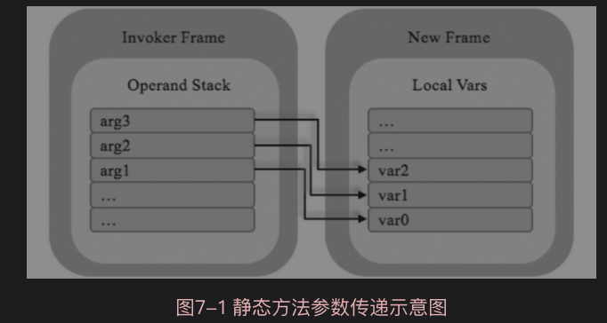

# 第7章 方法调用和返回

## 7.1 概述

方法可以分为两类：静态方法（或者类方法）和实例方法。静态方法通过类来调用，实例方法则通过对象引用来调用。静态方法是静态绑定的，也就是说，最终调用的是哪个方法在编译期就已经确定。实例方法则支持动态绑定，最终要调用哪个方法可能要推迟到运行期才能知道。

从实现的角度来看，方法可以分为三类：

1. 没有实现（也就是抽象方法）
2. 用Java语言（或者JVM上的其他语言，如Groovy和Scala等）实现
3. 用本地语言（如C或者C++）实现

静态方法和抽象方法是互斥的。在Java 8之前，接口只能包含抽象方法。为了实现Lambda表达式，Java 8放宽了这一限制，在接口中也可以定义静态方法和默认方法。

方法调用指令需要n+1个操作数。第1个操作数是uint16索引，在字节码中紧跟在指令操作码的后面。通过这个索引，可以从当前类的运行时常量池中找到一个方法符号引用，解析这个符号引用就可以得到一个方法。注意，这个方法并不一定就是最终要调用的那个方法，所以可能还需要一个查找过程才能找到最终要调用的方法。剩下的n个操作数是要传递给被调用方法的参数，从操作数栈中弹出。

如果要执行的是Java方法（而非本地方法），下一步是给这个方法创建一个新的帧，并把它推到Java虚拟机栈顶。传递参数之后，新的方法就可以开始执行。

## 7.2 解析

### 7.2.1 非接口方法符号引用

方法解析的第一步也是需要先解析出方法表的class_index项中索引的方法所属的类或接口的符号引用。当类或接口解析成功后，假设此类为C，接下来的步骤如下：

1. 由于Class文件格式中的方法和接口的方法符号引用的常量类型定义是分开的，如果在类的方法中发现`class_index`中索引的C是个接口，直接抛出`java.lang.IncompatibleClassChangeError`
2. 如果第一步通过，在类C中查找是否有简单名称和描述符都与目标相匹配的方法，如果有则返回这个方法的直接引用
3. 否则，在类C的父类中递归查找是否有简单名称和描述符都与目标相匹配的方法，如果有则返回这个方法的直接引用
4. 否则，在类C实现的接口列表以及它们的父接口之中递归查找是否有简单名称和描述符都与目标相匹配的方法，如果存在匹配的方法，说明类C是一个抽象类，查找结束，抛出`java.lang.AbstractMethodError`
5. 否则，查找失败，抛出`java.lang.NoSuchMethodError`
6. 最后，如果查找过程成功返回直接引用，将会对这个方法进行权限验证，如果发现不具备访问权限，跑出`java.lang.IllegalAccessError`

### 7.2.2 接口方法符号引用

接口方法解析的第一步也需要先解析出方法表的class_index项中索引的方法所属的类或接口的符号引用。当类或接口解析成功后，假设此类为C，接下来的步骤如下：

1. 如果在接口方法表中发现`class_index`中的索引C是个类而不是接口，直接抛出`java.lang.IncompatibleClassChangeError`
2. 否则，在接口C中查找是否有简单名称和描述符都与目标相匹配的方法，如果有则返回这个方法的直接引用
3. 否则，在接口C的父接口中递归查找，直到`java.lang.Object`，是否有简单名称和描述符都与目标相匹配的方法，如果有则返回这个方法的直接引用
   1. 接口方法的查找范围也会包括`java.lang.Object`方法
4. 对于规则3，由于Java支持接口多继承，如果C的不同父接口中存在多个简单名称和描述符都与目标匹配的方法，那将会从这多个方法中返回其中一个并结束查找
5. 否则，宣告方法查找失败，抛出`java.lang.NoSuchMethodError`
6. JDK9之前，Java接口中的所有方法默认为public

## 7.3 方法调用和参数传递

在定位到需要调用的方法之后，Java虚拟机要给这个方法创建一个新的帧并把它推入Java虚拟机栈顶，然后传递参数。

参数传递时，首先，要确定方法的参数在局部变量表中占用多少位置。注意，这个数量并不一定等于从Java代码中看到的参数个数，原因有两个：

1. `long`和`double`类型的参数要占用两个位置
2. 对于实例方法，Java编译器会在参数列表的前面添加一个参数，这个隐藏的参数就是`this`引用

假设实际的参数占据n个位置，依次把这n个变量从调用者的操作数栈中弹出，放进被调用方法的局部变量表中，参数传递就完成了。

注意，由于操作数栈是后进先出，因此在放入局部变量表时，参数索引是由大到小的。

## 7.4 返回指令

返回指令属于控制类指令，一共有6条。其中return指令用于没有返回值的情况，areturn、ireturn、lreturn、freturn和dreturn分别用于返回引用、int、long、float和double类型的值。

* return指令将当前栈桢从虚拟机栈中弹出即可
* 其他指令需要将当前被调用方法的栈桢从虚拟机栈中弹出，并将位于栈桢中操作数栈栈顶的对应类型的方法返回值压入调用方法栈桢的操作数栈中

## 7.5 方法调用指令

### 7.5.1 invokestatic

调用一个类的静态方法的指令。

首先从栈桢中找到当前方法对应的类，从类的常量池中找到要调用的静态方法的符号引用，解析对应的方法。如果要调用的方法不是静态方法，抛出`java.lang.IncompatibleClassChangeError`。

在解析要调用的静态方法时，如果对应的类没有被初始化，要先初始化对应的类。

### 7.5.2 invokespecial

调用实例构造器的`<init>()`方法、私有方法和父类中的方法。

异常情况：

* 如果从方法的符号引用中解析出的类是C，方法是M。如果M是构造函数，则声明M的类必须是C，否则抛出`java.lang.NoSuchMethodError`
* 如果M是静态方法，抛出`java.lang.IncompatibleClassChangeError`
* 从操作数栈中弹出this引用，如果为null，抛出`java.lang.NullPointerException`
* `protected`方法只能被声明该方法的类或子类调用，否则抛出`java.lang.IllegalAccessError`
* 如果调用的是超类中的函数，但不是构造函数，且当前类的`ACC_SUPER`标志位被置，需要一个额外的过程找到最终的方法
* 如果查找过程失败，或者找到的方法是抽象方法，抛出`java.lang.AbstractMethodError`

### 7.5.3 invokevirtual

用于调用所有的虚方法。

只要能被invokestatic和invokespecial指令调用的方法，都可以在解析阶段中确定唯一的调用版本，Java语言中符合这个条件的方法有：

* 静态方法
* 私有方法
* 实例构造器
* 父类方法

上述4种方法，加上被`final`修饰的方法（使用invokevirtula调用），这5类方法会在类加载时将符号引用解析为方法的直接引用。这些方法统称为**非虚方法**。

与之相反，其他地方的方法被称为虚方法。

### 7.5.4 invokeinterface

用于调用接口方法，会在运行时再确定一个实现该接口的对象。

invokeinterface指令的操作码后面跟着4字节而非2字节。前两字节的含义和其他指令相同，是个uint16运行时常量池索引。第3字节的值是给方法传递参数需要的slot数，其含义和给Method结构体定义的argSlotCount字段相同。正如我们所知，这个数是可以根据方法描述符计算出来的，它的存在仅仅是因为历史原因。第4字节是留给Oracle的某些Java虚拟机实现用的，它的值必须是0。该字节的存在是为了保证Java虚拟机可以向后兼容。

过程：

* 从当前方法对应的类的运行时常量池中拿到并解析接口方法的符号引用
* 如果解析得到的是静态方法或私有方法，抛出`java.lang.IncompatibleClassChangeError`
* 操作数栈中弹出`this`引用，如果引用为`null`，抛出`java.lang.NullPointerException`
* 如果`this`引用指向的对象的类没有实现解析出的接口，抛出`java.lang.IncompatibleClassChangeError`
* 从方法区中找到最终要调用的方法，如果找不到或者是抽象方法，抛出`java.lang.AbstractMethodError`
* 如果找到的方法不是`public`方法，抛出`java.lang.IllegalAccessError`
* 调用方法

### 小结

* invokestatic：调用静态方
* invokespecial：因为私有方法和构造函数不需要动态绑定，invokespecial指令可以加快方法调用速度。其次，使用super关键字调用超类中的方法不能使用invokevirtual指令，否则会陷入无限循环。
* 单独定义invokeinterface指令的原因：统一使用invokevirtual也可以，但是可能会影响效率。这两条指令的区别在于：
  * 当Java虚拟机通过invokevirtual调用方法时，this引用指向某个类（或其子类）的实例。因为类的继承层次是固定的，所以虚拟机可以使用一种叫作vtable（Virtual MethodTable）的技术加速方法查找。
  * 当通过invokeinterface指令调用接口方法时，因为this引用可以指向任何实现了该接口的类的实例，所以无法使用vtable技术。

