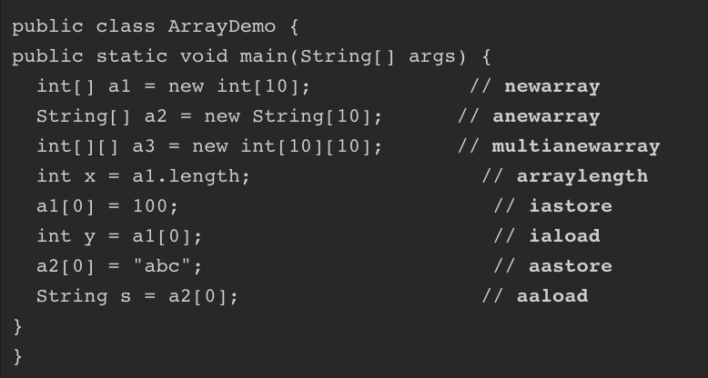

# 第8章 数组和字符串

Java虚拟机直接支持数组。对字符串的支持通过`java.lang.String`和相关类提供，`java.lang.String`底层通过字符数组进行存储。

如果数组的元素是基本类型，就把它叫作基本类型数组，否则，数组的元素是引用类型，把它叫作引用类型数组。

基本类型数组肯定都是一维数组，如果引用类型数组的元素也是数组，那么它就是多维数组。

## 8.1 数组概述

数组类和普通类的不同：

|          | 普通类                                       | 数组                                                         |
| -------- | -------------------------------------------- | ------------------------------------------------------------ |
| 类来源   | 从class文件加载                              | Java虚拟机运行时生成                                         |
| 类名     | class文件中解析                              | 类型描述符就是类名本身                                       |
| 对象创建 | new指令创建，构造函数初始化                  | 基本类型：newarray；引用类型：anewarray；多维数组：multianewarray |
| 存放数据 | 存放实例变量，通过putfield和getfield指令存取 | 存放数组元素，通过`<t>aload`和`<t>astore`系列指令按照索引存取 |

## 8.2 数组实现

### 8.2.1 数组对象

数组分配在堆中，通过引用使用

### 8.2.3 加载数组类

数组本身不通过类加载器创建，由Java虚拟机直接在内存中动态构造。一个数组类C的创建过程遵循以下原则：

* 组件类型（去掉一个维度的类型）为引用类型，递归加载过程
* 数组类的可访问性与其组件类型的可访问性一致，如果是基本类型，则默认为public

数组类的超类是`java.lang.Object`，并且实现`java.lang.Cloneable`和`java.io.Serializable`接口

## 8.3 数组相关指令



### 8.3.1 newarray

用于创建基本类型数组。需要两个操作数，第一个操作数是`uint8`整数，字节码中紧跟早指令操作码后，表示要创建的数组了行，称为`atype`：

```go
const (
	AT_BOOLEAN = 4
	AT_CHAR=5
	AT_FLOAT=6
	AT_DOUBLE=7
	AT_BYTE=8
	AT_SHORT=9
	AT_INT=10
	AT_LONG=11
)
```

第二个操作数是count，从操作数栈中弹出，表示数组长度。如果`coutn<0`，抛出`java.lang.NegativeArraySizeException`

### 8.3.2 anewarray

用于创建引用类型数组。需要两个操作数，第一个是uint16索引，来自字节码，指向当前类运行时常量池中的一个类符号引用，解析此符号引用即可得到数组元素的类；第二个是数组长度，从操作数栈中弹出。

### 8.3.3 arraylength指令

用于获取数组长度。只需要一个操作数，即从操作数栈顶弹出的数组引用，并将数组长度推入栈顶。如果数组引用为null，抛出`java.lang.NullPointerException`

### 8.3.4 \<t>aload指令

按索引取数组元素值，然后推入操作数栈。

需要从操作数栈中依次弹出索引和数组引用，如果数组引用为null，抛出`java.lang.NullPointerException`。如果数组索引发生越界，抛出`java.lang.ArrayIndexOutOfBoundsException`

### 8.3.5 \<t>astore指令

按索引给数组元素赋值。

需要从操作数栈中依次弹出三个操作数：

1. 要赋值给数组元素的值
2. 数组索引
3. 数组引用

如果数组引用为null，抛出`java.lang.NullPointerException`。如果数组索引发生越界，抛出`java.lang.ArrayIndexOutOfBoundsException`

### 8.3.6 multianewarray指令

创建多维数组。操作数如下：

1. uint16索引，来自字节码，用于从当前类的运行时常量池中找到类的符号引用，解析此引用获得多维数组类（不同于anewarray指令，该指令解析出的是数组元素的类）
2. uint8整数，来自字节码，表示数组维度
3. n个整数，表示每一个维度的数组长度，从操作数栈中弹出（逆序）

指令首先解析类的符号引用，获得多维数组类，随后从操作数栈中弹出每个维度的数组长度并校验，若长度小于0，抛出`java.lang.NegativeArraySizeException`。

随后递归创建多维数组，如果当前表示维度的数组长度大于1，表示接下来创建的仍是一个多维数组，当长度小于1时，表示创建的是一维数组，此时递归结束，函数返回。

数组类型转换相关：

* 数组可以强制转换成`Object`类型（因为数组的超类是`Object`）
*  数组可以强制转换成`Cloneable`和`Serializable`类型（因为数组实现了这两个接口）
* 如果下面两个条件之一成立，类型为`[]SC`的数组可以强制转换成类型为`[]TC`的数组：
  * `TC`和`SC`是同一个基本类型
  * `TC`和`SC`都是引用类型，且`SC`可以强制转换成`TC`

## 8.5 字符串

在class文件中，字符串是以MUTF8格式保存的，这一点在3.3.7节讨论过。在Java虚拟机运行期间，字符串以`java.lang.String`（后面简称`String`）对象的形式存在，而在`String`对象内部，字符串又是以UTF16格式保存的。

`String`类有两个实例变量：

* `private final char[] vaule;`：用于存放UTF16编码后的字符序列
* `private int hash;`：缓存字符串的哈希码

为了节约内存，Java虚拟机内部维护了一个字符串池。`String`类提供了`intern()`实例方法，可以把自己放入字符串池

```java
public native String intern();
```

### 8.5.1 字符串池


